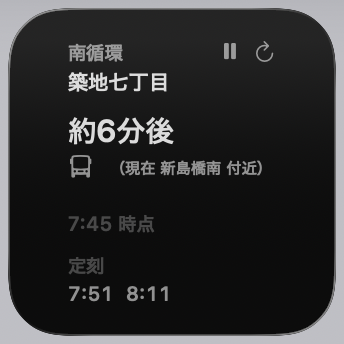
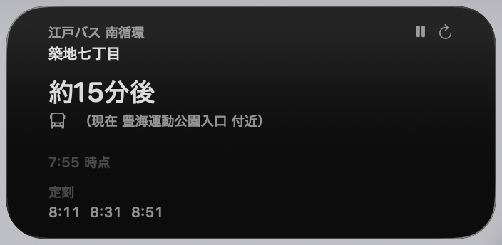
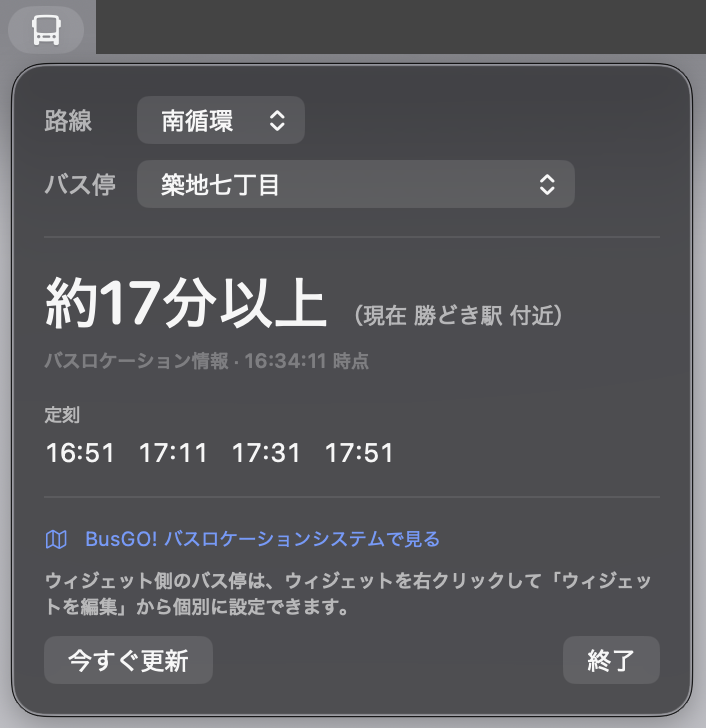
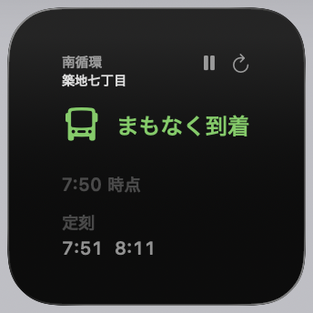
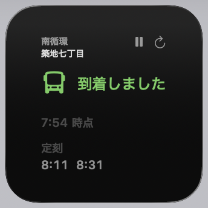
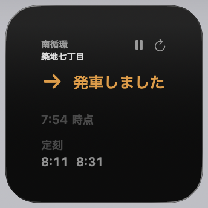
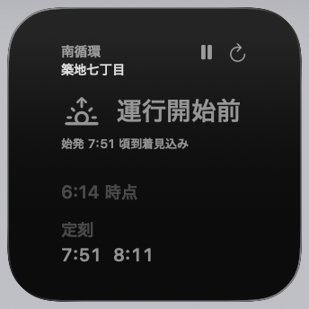
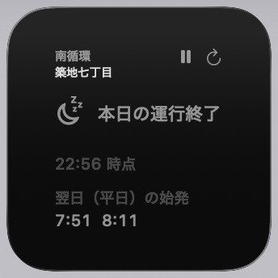

# 江戸バス 接近情報ウィジェット

中央区コミュニティバス「江戸バス」の次のバス到着時刻を表示する macOS ウィジェットです。
時刻表の定刻ではなく、**バスロケーションシステムの位置情報にもとづく到着見込み** を表示します。

<table>
<tr>
<td align="center"><br><sub>ウィジェット（小）</sub></td>
<td align="center"><br><sub>ウィジェット（中）</sub></td>
<td align="center"><br><sub>メニューバー</sub></td>
</tr>
</table>

## できること

- 通知センター / デスクトップに置ける WidgetKit ウィジェット（小・中サイズ）
- バスロケーションシステム由来の到着見込みを秒単位でカウントダウン表示
- ウィジェットごとに路線・バス停を選択（北循環 33 停留所 / 南循環 44 停留所）
- 平日・土曜・日祝の時刻表を自動判定（祝日は [holidays-jp](https://holidays-jp.github.io/) を参照）
- メニューバーに次のバスまでの分数を常時表示（クリックで路線・バス停の切り替え）

## 必要なもの

- macOS 14 以降
- Xcode 15 以降
- [XcodeGen](https://github.com/yonaskolb/XcodeGen)（`brew install xcodegen`）

## ビルドと導入

```sh
brew install xcodegen
xcodegen generate
open EdoBusWidget.xcodeproj
```

Xcode で以下を行ってください。

1. **Signing & Capabilities** で `EdoBusWidget` と `EdoBusWidgetExtension` の両ターゲットに自分の Team を設定する
   （無料の Personal Team で動作します）
2. スキーム `EdoBusWidget` を選んで実行（⌘R）する
   （Dock には出ず、メニューバーにバスのアイコンが常駐します）
3. 通知センターまたはデスクトップで「ウィジェットを編集」から「江戸バス接近情報」を追加する

常時使う場合は、システム設定 →「一般」→「ログイン項目」に登録しておくと便利です。

バンドル ID は `jp.shigeya.EdoBusWidget` です。自分の環境で使う場合は `project.yml` の
`bundleIdPrefix` と `PRODUCT_BUNDLE_IDENTIFIER` を書き換えてください。

App Group はアプリとウィジェットの間で一時停止の状態などを共有するために使っています。
macOS では App Group の識別子に Team ID のプレフィックスが必須なため、
`project.yml` で `APP_GROUP_ID: $(DEVELOPMENT_TEAM).jp.shigeya.EdoBusWidget` として組み立てています。
**`DEVELOPMENT_TEAM` を自分の Team ID にすれば、entitlement と実行時の参照先の両方に反映されます**
（コード側は Info.plist 経由で読み取るため、書き換え箇所はありません）。

> `group.` で始まる識別子はプロビジョニングプロファイルが必要になり、
> プロファイルなしのローカルビルドでは署名に失敗します。

> **署名について（重要）**
> アドホック署名（`CODE_SIGN_IDENTITY="-"`）ではビルドは通りますが、**ウィジェットは動きません**。
> AppIntents の登録に Team ID が必要で、署名に Team ID がないと
> `Unable to get teamId` となり設定パネルを解決できず、ウィジェットがプレースホルダのまま止まります。
> 無料の Personal Team で構わないので、必ず Team を設定して署名してください。

Xcode に Apple ID を登録していない場合は、キーチェーンの証明書を指定してコマンドラインからビルドできます。
`DEVELOPMENT_TEAM` には証明書の OU（`security find-certificate -c "<証明書名>" -p | openssl x509 -noout -subject` で確認）を指定します。

```sh
xcodebuild -project EdoBusWidget.xcodeproj -scheme EdoBusWidget \
  -configuration Debug -destination 'platform=macOS' \
  CODE_SIGN_STYLE=Manual \
  CODE_SIGN_IDENTITY="Apple Development: you@example.com (XXXXXXXXXX)" \
  DEVELOPMENT_TEAM=YOURTEAMID \
  PROVISIONING_PROFILE_SPECIFIER="" \
  CONFIGURATION_BUILD_DIR=build
```

`CONFIGURATION_BUILD_DIR=build` を付けると、DerivedData の奥深くではなく
プロジェクト直下の `build/EdoBusWidget.app` に成果物ができるので分かりやすくなります。

```sh
open build/EdoBusWidget.app
```

これで実行できますが、Dock にもアプリスイッチャーにも出ません（メニューバー常駐のため）。
メニューバーにバスのアイコンが増えているはずです。常用する場合は `/Applications` などに
コピーしてから起動し、ログイン項目に登録してください。

```sh
cp -R build/EdoBusWidget.app /Applications/
open /Applications/EdoBusWidget.app
```

起動後は前述の手順と同じく、通知センターまたはデスクトップの「ウィジェットを編集」から
「江戸バス接近情報」を追加してください。

> **ウィジェットギャラリーへの登録について**
> 手動での登録作業は不要です。ウィジェット拡張はアプリバンドルに組み込まれており（`embed: true`）、
> ビルド時に Xcode / `xcodebuild` が自動的に Launch Services へ登録します
> （ビルドログの `RegisterWithLaunchServices` がこれに当たります）。
> あとはアプリを一度起動するだけで、「ウィジェットを編集」のギャラリーに「江戸バス接近情報」が出てきます。
>
> もしギャラリーに出てこない場合は、たいてい次のどちらかが原因です。
> - Team 未設定のままアドホック署名でビルドしている（前述の `Unable to get teamId` 問題）
> - 別の場所（DerivedData など）でビルドした古いアプリが Launch Services に残ったまま
>   競合している。この場合はアプリを一度終了し、`open` で起動し直すと直ることが多いです

## バス停の変更

ウィジェットを右クリック →「ウィジェットを編集」で、路線とバス停を選べます。
路線を切り替えると、その路線に属する停留所だけが候補に出ます。
複数のウィジェットを置いて、それぞれ別のバス停を表示することもできます。

メニューバー側のバス停は、メニューバーアイコンをクリックして表示されるピッカーで切り替えます
（ウィジェットの設定とは独立しています）。

## 更新のしくみ

**このアプリはメニューバーに常駐します。** 常駐をやめるとウィジェットはほぼ更新されません。

WidgetKit 自体にも更新間隔を要求する仕組み（タイムライン）はありますが、
macOS では更新頻度が厳しく制限されており、あまり信頼できません。
実際、3 分間隔を要求しても、アプリを終了した状態では 11 分間まったく更新されませんでした。

そのため、メニューバーアプリが 60 秒ごとに情報を取得し、
`WidgetCenter.reloadAllTimelines()` でウィジェットを更新しています。
これが実質的な更新契機です。常駐した状態では 60 秒間隔での更新を確認しています。

取得間隔を変えたい場合は `App/EdoBusWidgetApp.swift` の `refreshInterval` を変更してください。
元データが分単位でしか出ないため、60 秒より短くしても表示はほとんど変わりません。

### サーバーへのリクエスト

時刻表・祝日一覧・路線/停留所一覧はキャッシュするため、毎回のリクエストは発生しません。

- 時刻表: 日付が変わるまでキャッシュ
- 祝日一覧: 24 時間キャッシュ
- 路線・停留所一覧: 1 時間キャッシュ

到着見込み（`get_guide_message_v2.php`）はキャッシュせず毎回取得しますが、
**取得はメニューバーアプリに一本化しており、ウィジェット拡張は自分では通信しません。**
アプリが 60 秒ごとに、自分が表示している停留所と、配置されている各ウィジェットが
表示している停留所（`WidgetCenter.getCurrentConfigurations` で検出）の分をまとめて取得し、
App Group 経由の共有ストレージに保存します。ウィジェット側はその値を読むだけです。
同じ停留所を指すウィジェットが何枚あっても、その停留所へのリクエストは 1 回にまとまります。

起動直後だけはキャッシュが空のため、路線・停留所一覧や時刻表の取得も加わり、リクエスト数が一時的に増えます。

### 一時停止

使わない時間帯は、メニューの「一時停止」でリクエストを完全に止められます。

- 定期取得を停止し、ウィジェットの更新も行いません
- メニューバーの表示が「停止中」になり、アイコンが塗りつぶしなしに変わります
- 設定は次回起動にも引き継がれます。停止したまま起動した場合は路線一覧すら取得しません
- 「今すぐ更新」は停止中でも取得します（明示操作のため）。ウィジェットのボタンから押した場合も、
  ウィジェット自身ではなくアプリに取得を依頼します（アプリが起動している必要があります）

一時停止中はバスロケーションシステムへの接続が発生しないことを確認しています。

## データソースについて

このアプリは、中央区が公開している
[BusGO! バスロケーションシステム](http://edobus.bus-go.com/) が内部で使用している
XML エンドポイントを直接利用しています。

| 用途 | エンドポイント |
| --- | --- |
| 路線一覧 | `get_route_info3.php` |
| 停留所一覧 | `get_bus_stop_info3.php` |
| 時刻表 | `get_time_table_info.php` |
| 到着見込み | `get_guide_message_v2.php` |

祝日の判定には、上記とは別に [holidays-jp](https://holidays-jp.github.io/) のAPIを使用しています
（取得に失敗した場合は祝日ではなく平日として扱います）。

**注意点**

- BusGO! は公式 API でもオープンデータでもありません。提供側の都合で予告なく変更・停止される可能性があります
- HTTPS に対応していないため HTTP で通信します（`project.yml` で該当ドメインのみ ATS 例外を設定）
- ウィジェットの更新は数分間隔です。公式サイトと同じ 5 秒間隔のポーリングはしていません

**時間表示について**

表示している「約 N 分後」は、
[バスロケーションシステムのサイト](http://edobus.bus-go.com/) に表示されているままの数値です。
このアプリ側で秒単位に換算したり、経過時間から減算したりといった加工は一切していません。

元の見込みが分単位でしか出ないため、秒送りのカウントダウンは行いません
（実際の値も「5 分」から「2 分」へ飛ぶことがあります）。
再取得するまで表示は同じ数値のままです。バスロケーションシステム側のタイムラグや道路状況により実際とずれることがあります。

### 到着見込みメッセージの扱い

サーバーが返すメッセージは以下の 8 形式を確認しており、それぞれ区別して表示します。

| メッセージ | 表示 |
| --- | --- |
| `現在、バスは「◯◯」付近です。あと約 N 分で到着します。` | 約 N 分後 |
| `現在、バスは「◯◯」を通過しました。あと約 N 分以上かかる見込みです。` | 約 N 分以上（下限値のため断定しない） |
| `まもなくバスが到着します。` | まもなく到着 |
| `バスが到着しました。` | 到着しました |
| `バスが発車しました。` | 発車しました |
| `この路線の運行はまだ開始されていません。この停留所への到着は07時47分頃になります。` | 運行開始前（時刻表ベースの絶対時刻を表示） |
| `この停留所に停車するバスは１時間以上ありません。次の到着は09時13分頃になります。` | しばらく到着なし（間引き運行など。時刻表ベースの絶対時刻を表示） |
| `本日、この停留所に停車するバスの運行は終了しています。` | 本日の運行終了（翌日の始発を併記） |

解釈できないメッセージは、そのまま本文を表示します。

<table>
<tr>
<td align="center"><br><sub>約 N 分後</sub></td>
<td align="center"><br><sub>まもなく到着</sub></td>
<td align="center"><br><sub>到着しました</sub></td>
</tr>
<tr>
<td align="center"><br><sub>発車しました</sub></td>
<td align="center"><br><sub>運行開始前</sub></td>
<td align="center"><br><sub>本日の運行終了</sub></td>
</tr>
</table>

## 構成

```
project.yml              XcodeGen のプロジェクト定義（Info.plist と entitlements はここから生成）
Shared/
  BusAPI.swift             エンドポイント定義と共通の XML パーサ
  BusStopConfig.swift      事業者設定・路線/停留所モデル・初期値
  BusDirectoryService.swift  路線・停留所一覧の取得（1 時間キャッシュ）
  BusScheduleService.swift   時刻表の取得
  BusLocationService.swift   到着見込みの取得とメッセージ解析
  HolidayChecker.swift       平日 / 土曜 / 日祝の判定
  SelectEdoBusStopIntent.swift  ウィジェット設定パネル（AppIntents）
WidgetExtension/         ウィジェット本体
App/                     メニューバー常駐アプリ（ウィジェットの更新もここから行う）
```

`Info.plist` と `*.entitlements` は `project.yml` から生成されるため、リポジトリには含めていません。
設定を変えるときは `project.yml` を編集して `xcodegen generate` を実行してください。

## ライセンス

[MIT License](LICENSE)

ライセンスが及ぶのはこのリポジトリのコードだけです。
江戸バスの運行データやバスロケーションシステムに対する権利は一切含みません。
データの利用可否については提供元の条件に従ってください。
